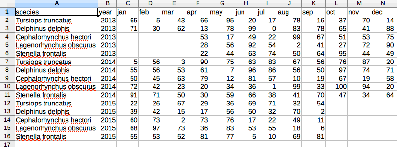
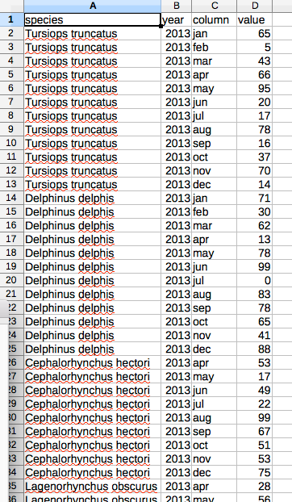

# CSVMultiTools

## What is it?
A set of CSV conversion tools I made for the [Belgian Biodiversity Platform](http://www.biodiversity.be).

## Matrix2List
### Description
Converts a matrix CSV file into a list CSV file.

Typically a matrix with n by m elements will result in a n*m rows in the generated list.

List rows will consist of starting cells from the matrix row, plus one 'column' cell and one 'value' cell from the matrix.

Empty values in the matrix will not result in a row.

### Usage
ruby matrix2list.rb inpath outpath startAt

Where:
* inpath: the input path of the matrix
* outpath: the output path of the generated list
* startAt: the index of first column to be converted:
all previous columns are copied to each list row,
all remaining columns (starting with this one) will result in a list row.

### Example
run <i>ruby matrix2List.rb examples/matrix.cvs examples/list.csv 2</i>
* matrix.csv hold two dimensions array, one column per month

* list.csv hold the generated list data, one row per month

* 2 means that jan is the first column of the two dimensions array

## List2Matrix
### Description
Converts back a lsit CSV file into a matrix CSV file.

Typically, a list of n*m rows will result in a n by m two dimensions generated matrix.

Matrix rows will consist of starting cells from the list row, plus m columns.

Values are supposedly placed as the last cell.

### Usage
ruby list2matrix.rb inpath outpath columnIndex

Where:
* inpath: the input path of the list
* outpath: the output path of the generated matrix
* columnIndex: the index of column field:
all distinct values of this field will result in an additional column in the matrix

### Example
run <i>ruby list2matrix.rb examples/list.csv examples/matrix.csv 2</i>
* list.csv hold same data as a list, one row per month

* matrix.csv hold the generated two dimensions array, one column per month

* 2 means that the month column should be used to build the matrix

## Requirements
CSVMultiTools are written in [Ruby](https://www.ruby-lang.org/) language.
Please use Ruby 1.9.3 or more recent version of the language.
They are based on and therefore require [CSV](http://ruby-doc.org/stdlib-1.9.3/libdoc/csv/rdoc/CSV.html) rubygem.
